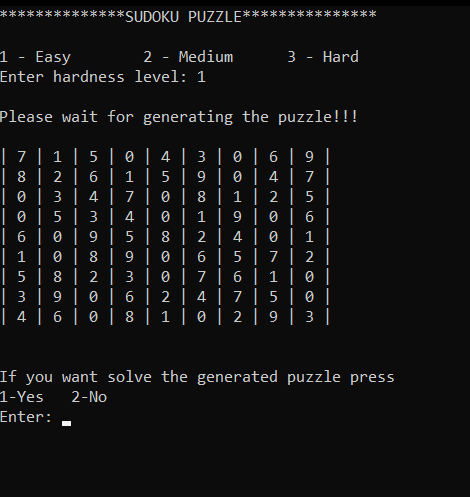

<h1 align="center">
   
  Sudoku-Generator-Solver in C++ 
   
</h1>

<h4 align="center">This is a sudoku game puzzle generator and also the solver in console based application.</h4>

  
  
  
   
  <a href="#description">Description</a> 

## Description

This sudoku generator is used the backtracking algorithm to solve it. Basically shows the all steps while it solving in each steps.

